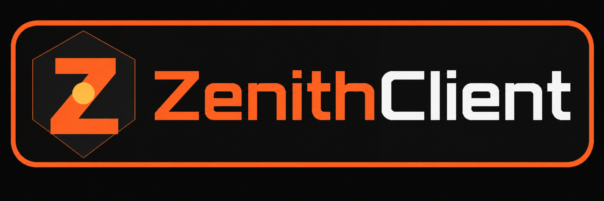

  

  <strong>Precision. Performance. Control.</strong> 
  A modular Fabric client built for combat, rendering, movement, and full in-game control.

---

# ZenithClient

ZenithClient is a configurable Minecraft client with a custom Click GUI and a growing set of combat, render, movement, and HUD modules. Every module can be toggled from the menu, assigned its own keybind, and configured from its settings page.

## Modules

### Render

- Player ESP, Entity ESP, Item ESP, and Projectile ESP
- Model outlines, boxes, fills, tracers, labels, colors, thickness, and range
- Block ESP with registry-based block selection
- X-Ray with selectable block lists and controlled renderer rebuilding
- Projectile trajectory prediction
- Fullbright, No Blindness, and No Fire Overlay
- Freecam with independent camera movement

### Combat

- Criticals
- Attribute Swap with configurable hotbar slot and restore delay
- Auto Totem
- Kill Aura with a selectable entity target list
- Reach and Infinite Reach controls
- Mace Kill with a small configurable simulated fall

### Movement

- Flight with separate horizontal and vertical speeds
- Speed
- Auto Sprint
- No Slow
- No Stun
- No Fall
- Air Jump

### HUD

- FPS display
- Coordinates display
- Toggle notifications

## Target lists

Entity ESP, Kill Aura, Block ESP, and X-Ray use searchable multi-select registry lists. Open the module settings and click or right-click the target row to choose multiple entities or blocks. Selected entries are saved as one module list instead of replacing the previous choice every time.

## Controls

- **Right Shift** — open or close ZenithClient
- **Left-click a module** — toggle it
- **Right-click a module** — open its settings
- **Click or right-click a target-list row** — open the multi-select registry menu
- **Escape** — return to the previous screen

## Building

1. Install **JDK 25**.
2. Run `build.bat`.
3. Choose one Minecraft version, a comma-separated list, or `all`.
4. Choose the next ZenithClient version.
5. The version is saved only after the requested build completes successfully. Failed builds restore the previous version automatically.

Successful JAR files are placed in `minecraft_versions/`, `releases/v<version>/`, and `releases/latest/`.

## Latest update

- Added X-Ray-only ore lighting so selected blocks render at maximum light even in enclosed caves.
- Replaced the unreliable Sodium face-state reflection with direct renderer state hooks and full-bright quad lighting.
- Kept every face of selected X-Ray blocks visible while hidden blocks remain removed from chunk meshes.
- Reworked Freecam movement so key states are no longer destroyed, left/right directions are correct, the camera moves smoothly, and the real player remains anchored.
- Disabled the older duplicate Freecam loop that was fighting the detached camera controller.
- Prevented Freecam movement packets from moving the real player while the detached camera is active.
- Made ESP cleanup persistent for the current world so former targets cannot turn into permanent white outlines after leaving range or disabling ESP.
- Rebuilt the main Click GUI with fixed-size cards and scrolling instead of shrinking buttons until text is cut off.
- Reworked the compact Z mark to match the banner and kept the hover animation at a fixed height while it reveals only to the right.
- The entity selector now virtualizes the complete loaded entity registry, shows the total count, supports every registered namespace, and has no artificial entry limit.
- Updated the Mod Menu icon with additional padding and a closed right edge so the mark is no longer cropped or squeezed.
- Failed builds still restore the previous project version automatically.

---

  ZenithClient is an independent project and is not affiliated with Mojang or Microsoft.

